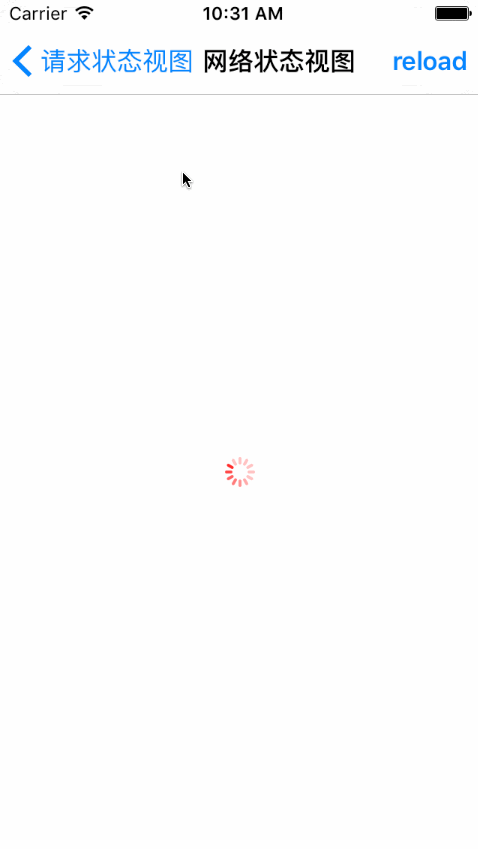

# NetworkStatusView
网络状态背景视图

网络状态，分以下几种情况
* 开始网络请求
  * 菊花转提示
  * 自定义图标、提示语
* 结束网络请求，成功
  * 自定义图标、提示语
  * 自定义图标、提示语、重新开始
* 结束网络请求，失败
  * 自定义图标、提示语
  * 自定义图标、提示语、重新开始

效果图

使用说明
~~~ javascript
// 导入头文件
#import "SYNetworkStatusView.h"
~~~ 

~~~ javascript
// 实例化
SYNetworkStatusView *statusView = [[SYNetworkStatusView alloc] initWithView:self.view];
~~~ 

~~~ javascript
// 属性设置
// 设置图标大小
statusView.sizeImage = CGSizeMake(80.0, 80.0);

// 重新开始按钮是否全屏
statusView.showButtonFullScreen = YES;

// 多图时的动画时间
statusView.animationTime = 1.0;

// 重新开始按钮属性设置
[statusView.reloadButton setTitle:@"再次刷新" forState:UIControlStateNormal];
[statusView.reloadButton setTitleColor:[UIColor redColor] forState:UIControlStateNormal];
[statusView.reloadButton setTitleColor:[UIColor yellowColor] forState:UIControlStateHighlighted];

// 信息标签属性设置
statusView.messageLabel.textColor = [UIColor redColor];
~~~ 

~~~ javascript
// 默认菊花转请求
[statusView loadStart];

// 自定义单图标、提示语请求
[statusView statusloadStartCustom:@"loading..." image:[UIImage imageNamed:@"lock_normal"]];

// 自定义多图标、提示语请求
[statusView loadStart:@"加载中..." image:@[[UIImage imageNamed:@"lock_normal"], [UIImage imageNamed:@"lock_right"], [UIImage imageNamed:@"lock_wrong"]]];
~~~ 

~~~ javascript
// 加载成功
[statusView loadSueccess];

// 加载成功，没有数据时，自定义单图标、提示语
[statusView loadSuccessWithoutData:@"没有数据" image:@[[UIImage imageNamed:@"lock_normal"]]];

// 加载成功，没有数据时，自定义多图标、提示语、重新请求
[statusView loadSuccessWithoutData:@"没有数据" image:@[[UIImage imageNamed:@"lock_normal"], [UIImage imageNamed:@"lock_right"], [UIImage imageNamed:@"lock_wrong"]] click:^{

}];
~~~ 

~~~ javascript
// 加载失败，自定义图标、提示语
[statusView loadFailue:@"加载失败" image:@[[UIImage imageNamed:@"lock_normal"]]];

// 加载失败，自定义图标、提示语、重新请求
[statusView loadFailue:@"加载失败" image:@[[UIImage imageNamed:@"lock_normal"], [UIImage imageNamed:@"lock_right"], [UIImage imageNamed:@"lock_wrong"]] click:^{

}];
~~~

## 修改完善
* 20170914
  * 版本号：1.0.0
  

